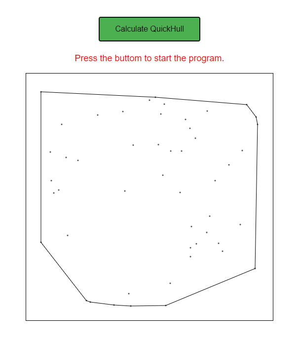

# QuickHull-JS

Module and program in browser javascript that computes QuickHull and provides a basic visualization using HTML canvas.

Live demo: [Github pages](https://faaa97.github.io/QuickHull-JS/)

